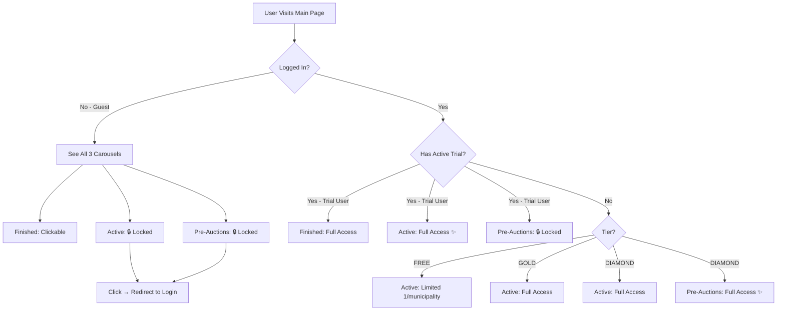

# Main Page Carousel & Access Control Implementation

## ✅ Changes Implemented

### 1. **Main Page Layout** - 3 Horizontal Carousels

The main page now displays **3 horizontal scrolling carousels** showing all auction types:

1. **Subastas Finalizadas** (Finished Auctions) - Top section, gray theme
   - ✅ Always accessible to everyone (guests and logged-in users)
   - ✅ No login required to view details
   
2. **Subastas Activas** (Active Auctions) - Middle section, green theme
   - 🔒 Greyed out/locked for guests
   - ✅ Accessible during trial period
   - ✅ Full access for paid subscribers (Gold/Diamond)
   
3. **Pre-Subastas** (Pre-Auctions) - Bottom section, amber theme
   - 🔒 Greyed out/locked for guests and trial users
   - 🔒 Locked for Gold tier
   - ✅ **Diamond tier ONLY** (labeled with "Diamond" badge)

### 2. **Access Control Logic**

#### For Guests (Not Logged In)
- ✅ See all 3 carousels
- ✅ Can view finished auction details
- 🔒 Active auctions show as locked teasers (title masked with 🔒)
- 🔒 Pre-auctions show as locked teasers
- 👉 Clicking locked auctions redirects to login page

#### For Trial Users (FREE tier with active trial)
- ✅ See all 3 carousels
- ✅ Full access to finished auctions
- ✅ **Full access to active auctions** (trial benefit)
- 🔒 Pre-auctions still locked (Diamond exclusive)

#### For FREE Users (Trial expired)
- ✅ See all 3 carousels
- ✅ Full access to finished auctions
- ⚠️ Limited access to active auctions (1 per municipality)
- 🔒 Pre-auctions locked

#### For GOLD Subscribers
- ✅ Full access to finished auctions
- ✅ Full access to all active auctions
- 🔒 Pre-auctions locked (need Diamond)

#### For DIAMOND Subscribers
- ✅ Full access to everything
- ✅ Exclusive access to pre-auctions

### 3. **API Changes**

**File**: `src/app/api/auctions/route.ts`

#### Key Updates:
1. **Trial Status Check**: API now checks if FREE tier users have an active trial
   - Pass `userId` in query params for trial verification
   - Trial users get full access to active auctions

2. **Guest Visibility**: Guests now see ALL auction types (but locked)
   - Removed filter that hid active/pre-auctions from guests
   - Masking function shows them as locked teasers

3. **Diamond-Only Pre-Auctions**: 
   - Changed from "Gold & Diamond" to "Diamond only"
   - Badge now says "Diamond" instead of "Premium"

4. **New Function Signature**:
   ```typescript
   function applyTierMasking(
     auctions: AuctionFromDB[], 
     userTier: UserTier | 'GUEST', 
     hasActiveTrial: boolean = false
   )
   ```

### 4. **Frontend Changes**

**File**: `src/app/page.tsx`

#### Updates:
1. **Pass userId**: Frontend now sends `userId` to API for trial check
2. **Section Order**: Changed to show finished first, then active, then pre-auctions
3. **Always Show 3 Sections**: All carousels visible regardless of content

**File**: `src/components/dashboard/CategorySection.tsx`

#### Updates:
1. **New Props**:
   - `premiumBadgeText`: Customizable badge text ("Diamond" for pre-auctions)
   - `isGuest`: Track guest status
   - Allow `null` for `userTier`

2. **Empty State**: Shows message when section has no auctions
3. **Always Render**: Removed conditional that hid empty sections
4. **Diamond Badge**: Blue/purple gradient instead of amber

### 5. **User Experience Flow**



### 6. **Benefit Summary**

| User Type | Finished | Active | Pre-Auctions |
|-----------|----------|--------|--------------|
| **Guest** | ✅ Full | 🔒 Locked | 🔒 Locked |
| **Trial** | ✅ Full | ✅ Full | 🔒 Locked |
| **FREE (expired trial)** | ✅ Full | ⚠️ Limited | 🔒 Locked |
| **GOLD** | ✅ Full | ✅ Full | 🔒 Locked |
| **DIAMOND** | ✅ Full | ✅ Full | ✅ Full |

### 7. **Visual Indicators**

- **Finished**: Gray theme, always accessible
- **Active**: Green theme, "Register for Trial" CTA for guests
- **Pre-Auctions**: Amber theme with **Blue/Purple "Diamond" badge**

### 8. **Trial Period Strategy**

**Goal**: Incentivize registration by giving trial users full active auction access

1. **Guests** see locked active auctions → encouraged to register
2. **New users** get 15-day trial with full active access → experience the value
3. **After trial** → upgrade to Gold for continued active access
4. **Diamond** → exclusive pre-auction access (competitive advantage)

---

## 🎯 Business Logic

### Conversion Funnel

1. **Guest** → Sees locked active auctions → **Registers**
2. **Trial User** → Gets full active access for 15 days → **Experiences value**
3. **Trial Expires** → Wants to maintain access → **Upgrades to Gold**
4. **Gold User** → Sees locked pre-auctions → **Considers Diamond**
5. **Diamond User** → Full access to early opportunities

### Tier Value Proposition

- **FREE**: Browse finished auctions (historical data)
- **TRIAL**: Test full active auction access (15 days)
- **GOLD**: Continuous active auction access
- **DIAMOND**: Early access to pre-auctions (competitive edge)

---

## 🔧 Technical Details

### Files Modified

1. `src/app/api/auctions/route.ts` - Access control logic
2. `src/app/page.tsx` - Main page layout and order
3. `src/components/dashboard/CategorySection.tsx` - Carousel component
4. `src/components/dashboard/UserProfileMenu.tsx` - Logout redirect (separate fix)

### Database Schema

No database changes required. Uses existing:
- `User.tier` (FREE, GOLD, DIAMOND)
- `User.trialStartDate`
- `User.trialEndDate`
- `User.hasUsedTrial`
- `Auction.status` (FINISHED, ACTIVE, PRE_AUCTION)

### API Endpoints

**GET `/api/auctions`**

Query Parameters:
- `tier`: User tier (defaults to GUEST if not provided)
- `userId`: User ID for trial status check
- `province`: Filter by province
- `category`: Filter by category

Response includes:
- Masked auction data based on tier
- `teaserCounts` for guests (total locked auctions)

---

## ✨ User Benefits

### For Guests
- Browse finished auctions freely
- See what's available (locked teasers)
- Motivated to register for trial

### For Trial Users
- Full active auction access
- Experience premium features
- 15 days to evaluate

### For Subscribers
- **Gold**: Continuous active access
- **Diamond**: Exclusive pre-auction access (first-mover advantage)

---

## 🚀 Next Steps

The implementation is complete and ready for testing. Users will now see:

1. **3 horizontal carousels** on the main page
2. **Proper access control** based on login status and tier
3. **Clear visual indicators** (badges, locked icons)
4. **Incentive to upgrade** (trial → Gold → Diamond)

All changes have been implemented with **no linter errors**.
