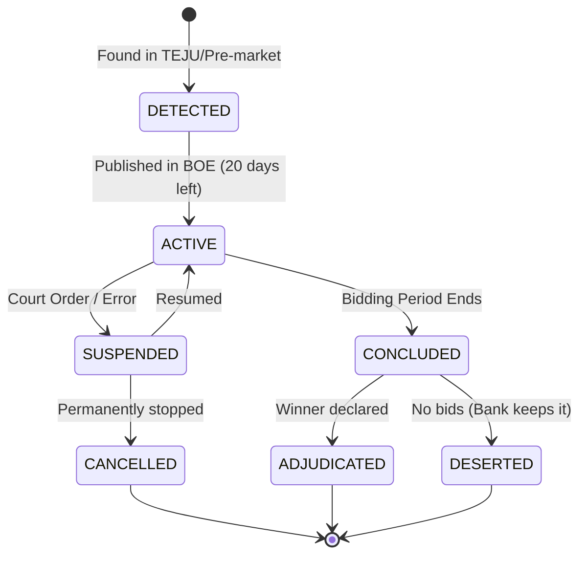

# SubastaPro Auction Scraping Workflow & Architecture

## 1. System Architecture

This document outlines the technical architecture for the SubastaPro ingestion engine. The goal is to aggregate real-time auction data from official government sources and private bank portfolios, normalizing them into a single reliable stream for user notifications.

### High-Level Data Flow

```mermaid
graph TD
    subgraph Sources
        BOE[BOE Official Portal]
        TEJU[Tablón Edictal (Pre-Auction)]
        Banks[Bank Portals (Servihabitat/Haya/etc)]
        Proc[Procuradores Portal]
    end

    subgraph Ingestion_Layer ["Ingestion Layer (Scrapers)"]
        S_BOE[Spider: BOE Monitor]
        S_TEJU[Spider: Edict Hunter]
        S_Banks[Spider: Bank API Consumer]
    end

    subgraph Processing_Layer ["Processing & Normalization"]
        Norm[Normalizer Service]
        Enrich[Enrichment Service (Cadastre/Geo)]
        Change[Change Detector]
    end

    subgraph Storage_Layer ["Data Persistence"]
        DB[(PostgreSQL + PostGIS)]
        Redis[Job Queue & Cache]
    end

    subgraph Notification_Layer ["User Delivery"]
        Matcher[Alert Matcher]
        Push[Notification Service]
    end

    BOE --> S_BOE
    TEJU --> S_TEJU
    Banks --> S_Banks
    Proc --> S_Banks

    S_BOE --> Norm
    S_TEJU --> Norm
    S_Banks --> Norm

    Norm --> Enrich
    Enrich --> Change
    Change --> DB
    Change --> Matcher
    Matcher --> Push
```

---

## 2. Comprehensive Source Registry

We categorize sources into **Official** (Legal truth) and **Commercial** (Market opportunities).

### A. Official Government Sources (The "Truth")

| Source Name | URL | Type | Priority | Frequency | Tech Strategy |
| :--- | :--- | :--- | :--- | :--- | :--- |
| **BOE Subastas** | `https://subastas.boe.es/` | Judicial/Tax | **CRITICAL** | Every 6h | `Scrapy` + `Requests` (No JS needed usually) |
| **TEJU (Tablón Edictal)** | `https://boe.es/notificaciones/` | Pre-Auction | HIGH | Daily | `Scrapy` (Search for "Ejecución Hipotecaria") |
| **Seguridad Social** | `https://sede.seg-social.gob.es/` | Tax/Debt | MEDIUM | Daily | `Playwright` (Complex navigation) |

### B. Private Bank Servicers (The "Opportunity")

Most of these sites are SPAs (Single Page Applications). **Do not scrape HTML.** Reverse-engineer their internal JSON APIs.

| Bank / Servicer | Portal URL | Internal API Endpoint (Indicative) | Notes |
| :--- | :--- | :--- | :--- |
| **Servihabitat** (Caixa) | `servihabitat.com` | `api.servihabitat.com/v1/assets` | Look for `assetType: REO` or `status: auction` |
| **Haya Real Estate** | `haya.es` | `haya.es/api/search` | Filter by `inmuebles_banco` & `cesion_remate` |
| **Altamira** (Santander) | `altamirainmuebles.com` | `api.altamira.com/search` | Often uses GraphQL or complex JSON payloads |
| **Solvia** (Sabadell) | `solvia.es` | `solvia.es/api/properties` | Look for "Campañas" or "Subastas" tags |
| **Aliseda** (Blackstone) | `alisedainmobiliaria.com` | `aliseda.com/api/v2/search` | |
| **Diglo** (Santander) | `digloservicer.com` | `diglo.com/api/assets` | Spin-off from Altamira |
| **Gipuzkoa/Bizkaia** | Provincial Tax Sites | Various | specialized local scraping required |

### C. Specialized Portals

| Source Name | URL | Type | Notes |
| :--- | :--- | :--- | :--- |
| **Subastas Procuradores** | `subastasprocuradores.com` | Semi-Official | Very reliable, often cleaner data than BOE |
| **Eactivos** | `eactivos.com` | Private Insolvency | Good for bankruptcy liquidations (Concursal) |

---

## 3. Data Lifecycle & State Machine

An auction is not a static record; it is a living event. We must track its state transitions to provide accurate notifications.

### The Auction State Machine



### Handling "Zombie" Pre-Auctions
*   **Definition:** A property found in TEJU (Pre-auction) that never appears in BOE within 90 days.
*   **Policy:**
    *   Mark as `STALE` after 60 days of inactivity.
    *   Mark as `ARCHIVED` after 120 days.
    *   **Do not delete.** Keep historical record for analytics.

---

## 4. Scraping Strategy & Implementation

### Tech Stack
*   **Core Framework:** Python + **Scrapy** (Best for high-concurrency crawling).
*   **Browser Automation:** **Playwright** (Only for bank sites with heavy JS or anti-bot protection).
*   **Task Queue:** **Redis** (To schedule spider runs).
*   **Proxy Rotation:** **Essential**. Use a provider like BrightData or Smartproxy. Spanish IPs preferred for BOE.

### Anti-Blocking & Reliability
1.  **User-Agents:** Rotate valid browser User-Agents for every request.
2.  **Rate Limiting:**
    *   BOE: 1 request per 2 seconds (Polite).
    *   Banks: 1 request per 5-10 seconds (Aggressive blocking likely).
3.  **Retries:** Implement exponential backoff (wait 2s, then 4s, then 8s) on 5xx errors.

### Frequency Schedule
*   **Real-Time (Priority):** BOE "Active" auctions. Check every **6 hours**.
*   **Daily:** Bank portals and TEJU (Pre-auctions). Run at **03:00 AM CET**.
*   **Weekly:** Full re-sync of all "Active" records to catch status changes (e.g., Suspensions) that might be missed by incremental scrapes.

---

## 5. Data Models (JSON Schema)

We normalize all inputs into this structure before saving to the database.

### `AuctionItem` (The Core Record)
```json
{
  "id": "SUB-JA-2024-12345",  // Unique ID (BOE ID or generated hash for banks)
  "source_url": "https://subastas.boe.es/...",
  "source_type": "BOE",       // BOE, BANK, PROCURATOR
  "status": "ACTIVE",         // DETECTED, ACTIVE, SUSPENDED, CONCLUDED
  "dates": {
    "detected_at": "2024-01-28T10:00:00Z",
    "start_date": "2024-02-01T00:00:00Z",
    "end_date": "2024-02-21T18:00:00Z"
  },
  "financials": {
    "appraisal_value": 150000.00,  // Valor Subasta
    "claim_amount": 85000.00,      // Cantidad Reclamada (Debt)
    "deposit_amount": 7500.00,     // 5% usually
    "min_bid_increment": 1000.00
  },
  "property": {
    "title": "Piso en Calle Mayor, Madrid",
    "description": "Vivienda de 90m2...",
    "cadastral_reference": "1234567AB1234C",
    "address_raw": "C/ Mayor 1, 2A, Madrid",
    "location": {
      "lat": 40.416775,
      "lng": -3.703790
    },
    "type": "RESIDENTIAL", // RESIDENTIAL, COMMERCIAL, LAND, VEHICLE
    "possession_status": "UNKNOWN" // FREE, OCCUPIED, UNKNOWN
  },
  "legal": {
    "court_name": "Juzgado 1ª Instancia Nº 5 Madrid",
    "file_number": "EJ/123/2023",
    "is_bankruptcy": false
  },
  "assets": {
    "images": ["url1.jpg", "url2.jpg"],
    "documents": ["certificacion_cargas.pdf"]
  }
}
```

---

## 6. Implementation Roadmap

### Phase 1: The Foundation (BOE)
1.  **Setup Scrapy Project:** Initialize `subasta_crawler`.
2.  **Build BOE Spider:**
    *   Input: List of Provinces.
    *   Action: Iterate pagination of active auctions.
    *   Output: Raw JSON items.
3.  **Database Schema:** Create PostgreSQL tables matching the Data Model.

### Phase 2: The Commercial Expansion (Banks)
1.  **API Analysis:** Use browser DevTools to map `servihabitat` and `haya` JSON endpoints.
2.  **Build Bank Spiders:** Create separate spiders for each major bank.
3.  **Normalization Logic:** Write mappers to convert Bank JSON -> `AuctionItem` schema.

### Phase 3: The Intelligence (Pre-Auction)
1.  **TEJU Scraper:** Build a text-search scraper for the Edictal Board.
2.  **Keyword Matcher:** Filter for "Subasta" and "Hipoteca" in edict texts.
3.  **Linker:** Try to match TEJU edicts to future BOE auctions by Court File Number (`file_number`).

### Phase 4: The Watchdog (Notifications)
1.  **Change Detector:** Script that compares `last_scraped_state` vs `current_state`.
2.  **Alert Dispatcher:** If `status` changes or `new_item` matches user filter -> Send Email/Push.

---

## 7. Backend Implementation Checklist

This section details the specific functions and modules to implement in the backend logic.

### 7.1. Scraper Engine (Ingestion Layer)
*   **Core Spider Functions**
    *   `init_spider(source_config)`: Initializes the spider with specific headers, proxies, and rate limits for the target source.
    *   `fetch_page(url, params)`: Handles HTTP GET requests with retry logic and error handling (404, 503, timeouts).
    *   `parse_listing_list(response)`: Extracts a list of auction URLs or IDs from a search results page.
    *   `parse_listing_detail(response)`: Extracts full details (price, description, dates) from a single auction page.
    *   `handle_pagination(response)`: Detects "Next Page" buttons and yields requests for subsequent pages.
*   **Source-Specific Parsers**
    *   `parse_boe_html(html_content)`: Specialized parser for the BOE's table-based layout.
    *   `parse_bank_json(json_payload)`: Generic handler for JSON responses from bank APIs (Servihabitat, Haya, etc.).
    *   `parse_teju_edict(pdf_text)`: Text extraction logic to find keywords ("Ejecución", "Subasta") in PDF edicts.

### 7.2. Normalization Service
*   **Data Mapping**
    *   `normalize_auction_item(raw_data, source_type)`: The main entry point that converts any raw input into the standard `AuctionItem` schema.
    *   `map_status(source_status)`: Maps source-specific statuses (e.g., "En periodo de pujas") to internal enums (`ACTIVE`, `CONCLUDED`).
    *   `clean_currency(value_str)`: Removes symbols (€), parses European formats (1.000,00), and returns a float.
    *   `parse_spanish_date(date_str)`: Converts strings like "28 de Enero de 2024" to ISO 8601 UTC timestamps.
*   **Category Classification**
    *   `infer_category(title, description)`: Uses keyword heuristics to classify items if the source category is vague (e.g., "Vivienda" vs "Local").

### 7.3. Enrichment Service
*   **Geolocation**
    *   `geocode_address(raw_address)`: Calls Google Maps/Mapbox API to get `lat/lng` coordinates.
    *   `parse_cadastral_ref(ref_id)`: Validates the 20-character Catastro reference.
    *   `fetch_cadastral_data(ref_id)`: Hits the Catastro API to get exact square footage, year built, and usage class.
*   **Media Handling**
    *   `extract_image_urls(html/json)`: Finds high-res image links.
    *   `download_and_store_image(url)`: (Optional) Downloads images to S3/R2 to prevent hotlinking issues.

### 7.4. Data Persistence & State Management
*   **Database Operations**
    *   `upsert_auction(auction_item)`: Checks if `id` exists. If yes -> update fields; If no -> insert new record.
    *   `find_duplicate_by_ref(cadastral_ref)`: Checks if the same property is listed on multiple portals (e.g., BOE + Bank).
    *   `archive_stale_auctions()`: periodic job to mark auctions as `FINISHED` if their end date has passed.
*   **State Transitions**
    *   `detect_status_change(old_item, new_item)`: Compares status fields to identify transitions (e.g., `ACTIVE` -> `SUSPENDED`).
    *   `link_pre_auction_to_active(teju_id, boe_id)`: Logic to merge a "Pre-Auction" record into an "Active" record when it finally appears in the BOE.

### 7.5. Notification System
*   **Alerting Logic**
    *   `match_user_filters(auction_item)`: Queries the `UserAlerts` table to find users interested in this specific property (by province, price, type).
    *   `queue_notification(user_id, auction_id, type)`: Adds a notification job to Redis (Email/Push).
    *   `send_email_digest(user_id, items)`: Batches multiple updates into a single daily email.
